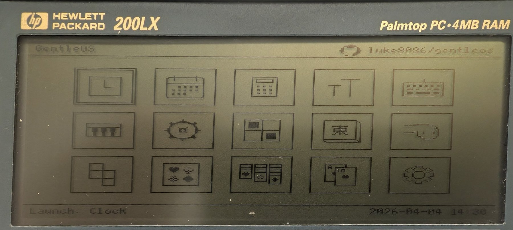
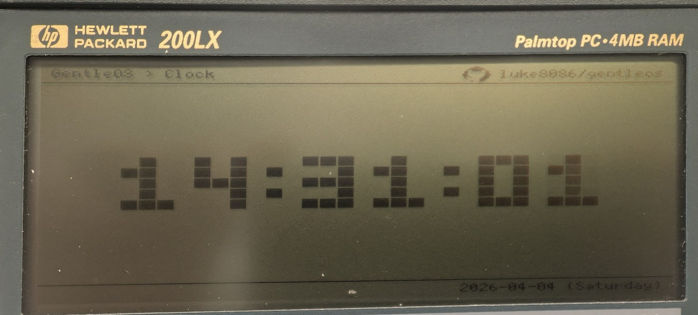
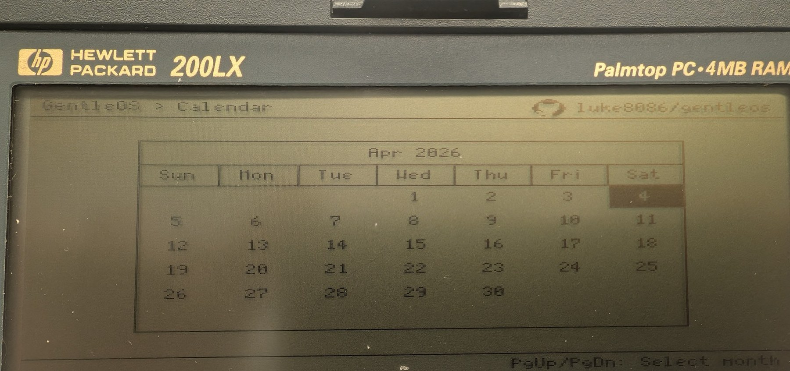
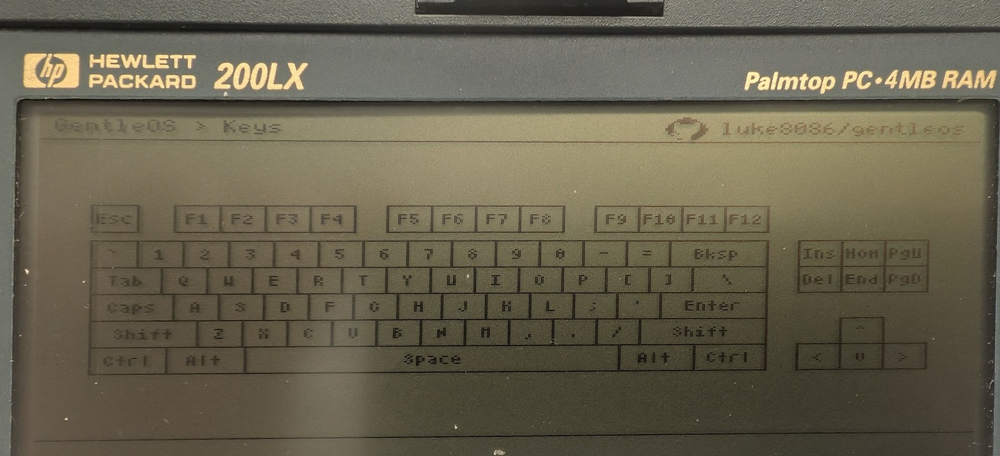
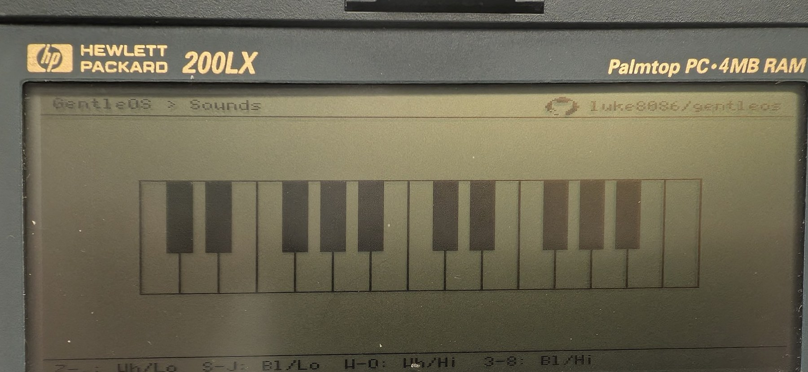
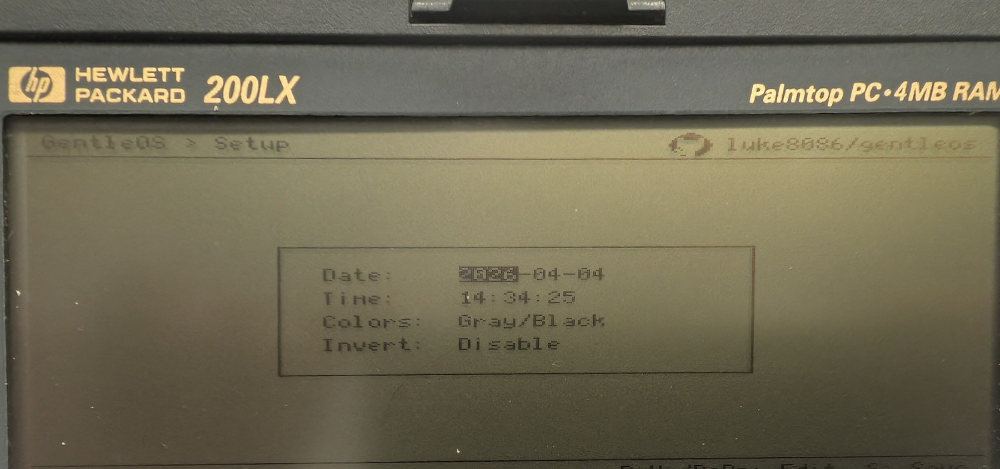

# GentleOS/16 on the HP 200LX

This repository packages an HP 200LX-focused build of
[GentleOS/16](https://github.com/luke8086/gentleos), with a compatibility fix
for the built-in HP 200LX keyboard.

Release 1: `KERNEL.COM` boots from DOS on a real HP 200LX, reaches the
GentleOS launcher, and the built-in HP 200LX keyboard works.

<p>
  
</p>

## Hardware Tested

- HP 200LX Palmtop PC
- 80186-compatible Hornet-based system
- CGA-compatible 640x200 LCD, running GentleOS in CGA 320x200 mode
- Built-in HP 200LX keyboard
- Launched from DOS as `KERNEL.COM`

The safest way to test this build is still the DOS `.COM` path:

```dos
CD \GENTLE
KERNEL
```

When running as `KERNEL.COM`, GentleOS can return to DOS with `Shift-Q`.

## Release Download

For users who want to try this build without setting up the DOSBox build
environment, Release 1 includes a prebuilt `KERNEL.COM`:

- [Download Release 1](https://github.com/l00nix/gentleos-hp200lx/releases/tag/v1.0.0)
- Expected file: `KERNEL.COM`
- Size: `46,238` bytes
- SHA-256:
  `e5c70b387a3aaae79f455f48767fccf2610318dc6a6be352c71a197601372e3b`

## Screenshots

The photos below are cleaned publication copies with camera metadata removed.
Original photos are not required to build or run GentleOS.

<p>
  
  
  
  
  
  
</p>

More screenshots are in [README-images-straight](README-images-straight/).

## What Changed

The HP 200LX looks PC-compatible from DOS, but its internal keyboard is not a
plain PC/XT keyboard controller.

On a normal PC, keyboard hardware places a scan code in I/O port `60h` and
raises IRQ1/INT 09h. GentleOS originally installed its own INT 09h handler,
read port `60h`, toggled port `61h`, and acknowledged the PIC directly.

On the HP 100LX/200LX, the Hornet ASIC and BIOS cooperate differently:

- The physical keyboard is scanned and debounced by HP BIOS code.
- Initial keyboard events arrive through Hornet IRQ2/INT 0Ah.
- TIMER1 is used by the BIOS to debounce and generate PC-style scan codes.
- The BIOS writes scan codes to port `60h`, then causes a synthetic INT 09h.
- Applications are expected to consume the resulting keyboard stream through
  BIOS INT 16h.

So this repository adds an HP 200LX keyboard mode:

- Do not replace the BIOS INT 09h handler on HP 200LX builds.
- Poll BIOS INT 16h extended keyboard services from the GentleOS event wait
  loop.
- Convert the returned BIOS scan code and modifier state into GentleOS
  `EVENT_KEY_DOWN` events.
- Keep the existing direct INT 09h/port `60h` keyboard path available for
  ordinary PC-compatible targets.

The CGA-safe color setting is also enabled:

```c
#define DEFAULT_VGA_THEME 0
#define HP200LX_BIOS_KEYBOARD 1
```

## Diff Summary

The complete patch is saved as [doc/hp200lx-change.diff](doc/hp200lx-change.diff).

The key parts are:

```diff
+#define HP200LX_BIOS_KEYBOARD 1
```

```diff
+global int
+bios_key_ready(void)
+{
+    regs.h.ah = 0x11;
+    intr(0x16, &regs);
+    return !(regs.x.flags & 0x0040);
+}
+
+global uint16_t
+bios_get_key_ext(void)
+{
+    regs.h.ah = 0x10;
+    intr(0x16, &regs);
+    return regs.x.ax;
+}
```

```diff
+global void
+krn_keyboard_poll(void)
+{
+#if HP200LX_BIOS_KEYBOARD
+    while (bios_key_ready()) {
+        bios_key = bios_get_key_ext();
+        key.p.code = (uint8_t)(bios_key >> 8);
+        key.p.mods = bios_get_key_mods();
+        ...
+        (void)krn_event_push(&ev);
+    }
+#endif
+}
```

```diff
 krn_event_wait(event_st *out)
 {
     while (1) {
+        krn_keyboard_poll();
         if (krn_event_count() > 0 && krn_event_pop(out) == 0) {
             break;
         }
```

```diff
 krn_keyboard_init(void)
 {
     krn_debug_printf("Initializing keyboard... ");

+#if HP200LX_BIOS_KEYBOARD
+    krn_debug_printf("bios\n");
+#else
     krn_get_isr(0x09, &saved_isr_handler);
     krn_set_isr(0x09, krn_main_segment, (uint16_t)(uint32_t)&krn_isr_keyboard);
     krn_debug_printf("ok\n");
+#endif
 }
```

## Building

This repo includes helper scripts for the DOSBox-based upstream build flow:

```bash
tools/setup-ubuntu-dosbox.sh
tools/build-dosbox.sh
```

The expected real-hardware test artifact is:

```text
BUILD/KERNEL.COM
```

Avoid writing `DISK.IMG` or floppy images to physical media until the `.COM`
path behaves correctly on the target palmtop.

## Upstream

This work is based on Luke A. Guest's
[GentleOS/16](https://github.com/luke8086/gentleos), a hobby operating system
for vintage 16-bit PCs.

GentleOS/16 is licensed under [GPLv2](LICENSE). See the upstream project and
vendored asset directories for original attributions.

## Notes

This is intentionally a small compatibility patch rather than a full HP 200LX
platform layer. A deeper port could eventually expose the HP 200LX keyboard
mode as a build target, add Hornet-specific timer handling, and separate
runtime platform detection from compile-time configuration.
